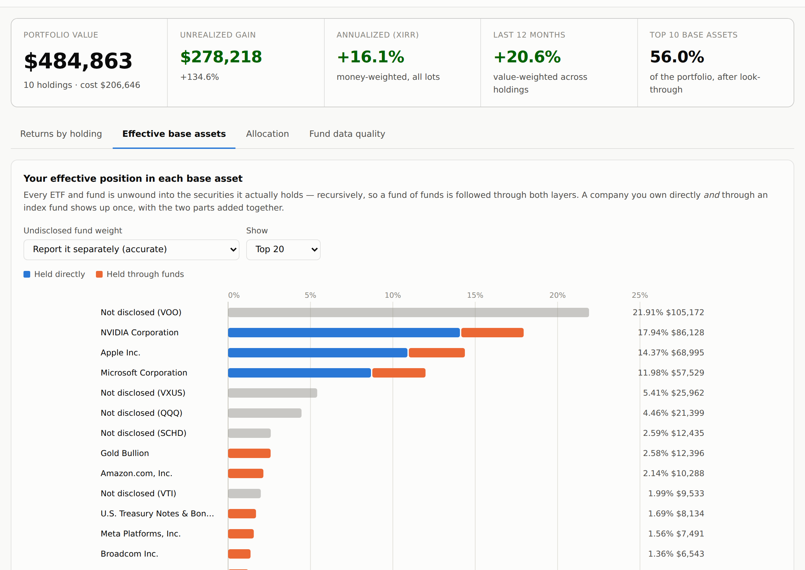

# StockAnalyzer7

A local web app for two questions that most portfolio trackers answer badly:

1. **What has each of my holdings actually returned, year by year?**
2. **What do I really own?** — after every ETF and fund is unwound into the
   securities it holds, so you can see your *effective* position in each base
   asset.

Everything runs on your machine. Your holdings are never sent anywhere except
to the market-data provider you configure, and then only as ticker symbols.



## Quick start

```bash
git clone <this repo> && cd StockAnalyzer7
./run.sh
```

Then open <http://127.0.0.1:8000> and press **Load sample portfolio**.

`run.sh` creates a virtualenv and installs dependencies on first run. To do it
by hand:

```bash
python3 -m venv .venv && . .venv/bin/activate
pip install -r requirements.txt
python -m uvicorn backend.app.main:app --port 8000
```

To try it with no market-data access at all, run against the bundled offline
dataset:

```bash
SA_PROVIDER=fixtures ./run.sh
```

## Loading your holdings

Import a CSV exported from your broker, or type positions in directly. The
importer sniffs out the columns, so most broker exports work unmodified —
preamble rows, `$` signs, `(1,234.00)` negatives and all. It recognizes:

| Column | Aliases it accepts | Notes |
|---|---|---|
| `symbol` | ticker, security, instrument | required |
| `quantity` | shares, qty, units, position | required |
| `cost_per_share` | average cost, purchase price, unit cost | |
| `cost_basis` | total cost, book value, amount invested | used if there is no per-share cost |
| `purchase_date` | date acquired, trade date, open date | drives the money-weighted return |
| `account` | account name, portfolio | |

**Use one row per purchase lot.** Several rows for the same ticker are combined
into one position, and the individual dates and prices drive the money-weighted
return. A `CASH` row is treated as a cash balance rather than a security.

Anything the importer cannot read is reported — rows are never silently dropped.

## How the returns are calculated

The app deliberately reports two different numbers, because collapsing them
into one is how portfolio tools end up lying to you:

- **The security's return** — total return (price movement plus dividends) over
  a calendar year, computed from the dividend-adjusted price series. It does not
  depend on when you bought, so it is comparable across holdings and to an index.
- **Your return on the position** — money-weighted (XIRR) over your actual
  purchase dates and amounts. A lot you bought last month cannot flatter a
  position you have held for five years, and doubling down before a rally is
  correctly rewarded.

Both appear in the year-by-year table; the toggle above it switches between
them. The **Annualized (XIRR)** figure on the summary tiles is the money-weighted
return across every lot in the portfolio.

### Dividends

Providers hand back two price series: the raw `close`, and an `adj_close` that
rewrites history as though every dividend had been reinvested. The gap between
them is the dividend, and which one a calculation uses decides whether income
is counted:

| Figure | Series | Dividends |
|---|---|---|
| The security's yearly and 12-month return | `adj_close` | included |
| Position value and unrealized gain | `close` | excluded — correctly, since the cash was paid out, not retained in the position |
| Your return on the position (yearly and annualized) | both | included, as dated cash flows |

For the money-weighted figures the dividend is reconstructed per period from
the two series (`dividend_flows` in `services/returns.py`), dated where it
actually fell and credited only to shares held at the time — so a lot bought in
November does not collect a dividend paid in July.

This matters most where you would least like to be wrong. A bond fund like
`BND`, measured on price alone, reports −3.6% a year; with its coupons counted
it is −0.7%. `SCHD` goes from 5.3% to 9.0%.

Note that a money-weighted return and a reinvested total return will not match
exactly even when both count dividends — the first treats a dividend as cash
returned to you on the day, the second as shares bought that day. On a
high-yield holding through a volatile stretch the two can differ by a point or
two, and neither is wrong; they answer different questions.

Some deliberate choices:

- A partial year is **flagged, not annualized.** Annualizing three months of
  data produces a number that looks precise and means nothing.
- Trailing-12-month returns are anchored to the **latest available price**, not
  to the wall clock, so a lagging feed cannot report a three-month figure under
  a twelve-month heading.
- A window the price history cannot cover returns nothing rather than a
  mislabeled shorter one.
- Lots with no purchase date are excluded from the money-weighted return, and
  the app says so instead of guessing a date.

## Fund look-through

This is the part most tools skip. Every ETF and mutual fund is expanded into its
constituents, recursively — a fund of funds such as `VT` is followed through
`VTI` and `VXUS` down to the individual companies — with cycle detection and a
configurable depth limit. Exposure to the same company from several sources is
summed, and the report separates what you hold **directly** from what you hold
**through funds**.

In the sample portfolio, NVIDIA is 14% of the portfolio as a direct position but
**18% in effective terms**, because it is also the largest position in both `VOO`
and `QQQ`. That gap is the entire point of the feature.

### Data coverage, and why the app admits what it doesn't know

Free quote APIs publish only a fund's **top ten positions** — roughly 43% of an
S&P 500 fund and as little as 8% of a total-international fund. StockAnalyzer7
reports the rest as **"not disclosed"** rather than quietly renormalizing the
known holdings to 100%, which would overstate every position it *does* know
about. The *Fund data quality* tab shows exactly how much of each fund was
visible and where the data came from.

To get to complete coverage, download a fund's holdings file from its issuer —
iShares and SPDR link a "Holdings" CSV on every fund page, Vanguard publishes one
under *Portfolio & Management* — and upload it on that tab, or drop it in
`data/etf_holdings/<SYMBOL>.csv`. Any file with a name-or-ticker column and a
weight column parses. See [`data/etf_holdings/README.md`](data/etf_holdings/README.md).

If you would rather have a best-estimate shape than a coverage-honest one, the
*Undisclosed fund weight* selector will spread each fund's untracked tail across
its known holdings instead. It is clearly labeled as an estimate.

## Configuration

All settings are environment variables:

| Variable | Default | What it does |
|---|---|---|
| `SA_PROVIDER` | `yahoo` | `yahoo` for live data (via `yfinance`, no API key), or `fixtures` for the offline dataset |
| `SA_FALLBACK_FIXTURES` | `1` | Fall back to the offline dataset when the live provider is unreachable, and say so in the UI |
| `SA_DATA_DIR` | `./data` | Where portfolios, caches and holdings files live |
| `SA_DB_PATH` | `./data/portfolio.db` | SQLite file for saved portfolios |
| `SA_CACHE_TTL` | `3600` | Seconds before a cached quote, price history or composition is refetched |
| `SA_MAX_DEPTH` | `4` | How deep to follow funds that hold other funds |
| `SA_ISSUER_DOWNLOADS` | `1` | Allow fetching holdings files from URLs registered in `sources.json` |
| `SA_BASE_CCY` | `USD` | Reporting currency label |

## API

The UI is a thin client over a documented JSON API — interactive docs at
<http://127.0.0.1:8000/docs>.

| Endpoint | Purpose |
|---|---|
| `POST /api/analyze` | Value the portfolio and compute per-holding returns |
| `POST /api/lookthrough` | Expand funds into base assets (`?scale_to_full=`, `?max_depth=`) |
| `POST /api/portfolio/import` | Parse a broker CSV into a portfolio |
| `GET/POST/DELETE /api/portfolio` | Save, load and delete named portfolios |
| `POST /api/holdings-file/{symbol}` | Register a fund's full holdings CSV |
| `GET /api/health` | Active provider, degraded state, available holdings files |

## Project layout

```
backend/app/
  config.py           environment-driven settings
  models.py           pydantic schemas shared everywhere
  importers.py        broker-CSV sniffing and parsing
  storage.py          SQLite persistence for saved portfolios
  providers/
    base.py           provider protocol + asset-class classification
    yahoo.py          live data via yfinance
    fixtures.py       the offline dataset
    holdings_files.py issuer holdings CSV parsing
    cache.py          TTL cache on disk
  services/
    returns.py        XIRR, calendar-year and trailing returns
    lookthrough.py    recursive fund expansion
    exposure.py       aggregation into the report tables
    analyzer.py       ties it together
frontend/             no build step: one HTML file, one CSS file, one JS file
data/fixtures/        the offline dataset (see scripts/build_fixtures.py)
tests/                90 tests, all runnable offline
```

The charts are hand-rolled inline SVG rather than a charting library, so the
whole app runs from a single local server with no network access and no
`node_modules`.

## Development

```bash
pip install -r requirements-dev.txt
python -m pytest            # 90 tests, no network required
```

The test suite runs entirely against the checked-in fixture dataset, so it is
deterministic and works offline. Regenerate that dataset with
`python3 scripts/build_fixtures.py`.

## Limitations worth knowing

- **The offline dataset is synthetic.** `data/fixtures/` is a seeded random walk
  pinned to plausible annual returns. It exists so the app and its tests run
  without network access. It is not real market history and must not be read as
  such. Live mode uses real data.
- **Single currency.** Positions are reported in their quoted currency with no
  FX conversion; a multi-currency portfolio will not total correctly yet.
- **No realized gains.** Only open positions are analyzed. Sales, and therefore
  realized P&L and tax lots, are not modeled.
- **Fund data is as of the issuer's last publication**, typically daily but
  sometimes month-end. Look-through is only ever as current as that file.
- **Yahoo Finance is an undocumented endpoint.** It is free and needs no key, but
  it rate-limits and occasionally changes shape. The disk cache and the fixture
  fallback exist for exactly that reason.
- **This is not investment advice**, and the numbers should be checked against
  your broker's own statements before you act on them.
